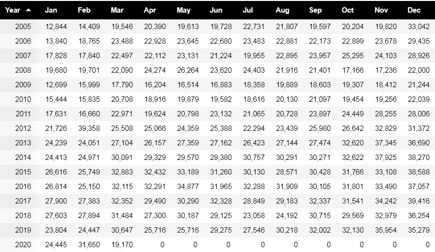

# Time-Series-Project--Daimler-Benz-Car-Sales-Prediction

+ [Table of Contents](#sub-sub-heading-1)
    + [Credits](#credits)
    + [Project Goal and procedure](#project-goal-and-procedure)
    + [Code and Resources](#code-and-resources)
    + [Part 1- Scraping Data with Selenium](#part-1--Scraping-data-with-selenium)
    + [Part 2- Data Cleaning and Feature Engineering](#part-2--Data-cleaning-and-feature-engineering)
    + [Part 3- Data Visualization and insigths](#part-3--data-visualization-and-insigths)
    + [Part 4- Project Limitation and Conclusion](#part-4--project-limitation-and-conclusion)
    
### Credits: 
A big thank you goes to [KenJee](https://www.youtube.com/channel/UCiT9RITQ9PW6BhXK0y2jaeg), [Codebasics](https://www.youtube.com/channel/UCh9nVJoWXmFb7sLApWGcLPQ), [Krish Naik](https://www.youtube.com/user/krishnaik06), [Keith Galli](https://www.youtube.com/channel/UCq6XkhO5SZ66N04IcPbqNcw)  and to the whole [Edureka Team](https://www.youtube.com/user/edurekaIN) who put a lot of effort to teach people Data Science, Machine Learning, Statistics and a lot of other related topics for free.

### Project Goal and procedure: 
* Goal: Predict/Forecast future car sales for Daimler in the U.S. market
* Scraped previous sales data from [Goodcarbadcar.com](https://www.goodcarbadcar.net/daimler-ag-us-sales-figures/) using Python and BeautifulSoup
* Availabe data: From January, 2005- March, 2020 (183 months)
* Time Series: The Time Series method is a sequence of observations which is recorded at regular time intervals. This is the initial step before we can forecast future sales.

### Code and Resources
* Python Version: 3.8
* Environment: Jupyter Notebook
* Packages: BeautifulSoup, Matplotlib, Numpy, Statsmodels

## Part 1- Scraping Data with BeautifulSoup
The be able to develop a forecast, we need to take a look on the previous data. Therefore, the following table which contains sales information from January 2005- March 2020, will be scraped:

After saving the necessary data, I saved it in a cav file and opened it by using the Python's pandas package:

Visualization of the scraped data in a graph: 

